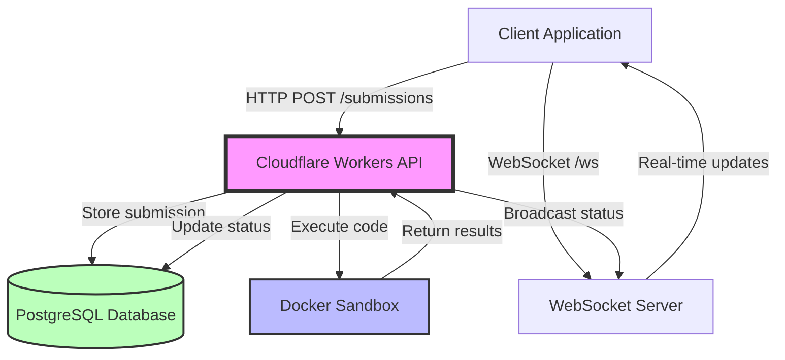
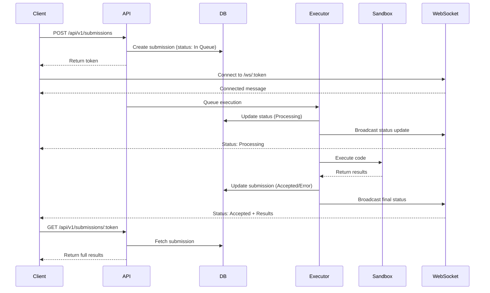

# Run-Flare: Complete Learning Guide for Students

## 📋 Table of Contents
1. [Project Overview](#project-overview)
2. [Technology Stack](#technology-stack)
3. [Architecture Overview](#architecture-overview)
4. [Project Structure](#project-structure)
5. [Core Concepts](#core-concepts)
6. [Learning Path](#learning-path)
7. [Key Features to Study](#key-features-to-study)

---

## 🎯 Project Overview

**Run-Flare** is a **cloud-based code execution API** that allows users to submit code in multiple programming languages and execute it securely in isolated sandboxes. Think of it as a "Judge0" or "LeetCode execution engine" that you can integrate into your own applications.

### What Does It Do?
- Accepts code submissions via REST API
- Executes code in secure, isolated Docker containers
- Supports multiple languages (JavaScript, Python, C++, Java)
- Returns execution results (output, errors, time, memory usage)
- Provides real-time updates via WebSocket
- Handles batch submissions for running multiple test cases

### Real-World Use Cases
- Online coding platforms (like LeetCode, HackerRank)
- Educational platforms for programming courses
- Code playground/IDE features in websites
- Automated code testing systems

---

## 🛠️ Technology Stack

### 1. **Runtime Platform: Cloudflare Workers**
```
What: Serverless JavaScript runtime at the edge
Why: Global distribution, low latency, automatic scaling
Key Features:
  - Runs on V8 engine (same as Chrome)
  - Distributed across 300+ data centers worldwide
  - No cold starts, instant execution
  - Built-in DDoS protection
```

**Learn More:**
- [Cloudflare Workers Docs](https://developers.cloudflare.com/workers/)
- Concepts: Edge computing, serverless architecture

---

### 2. **Language: TypeScript**
```typescript
// Example from the codebase
export interface SubmissionRequest {
  source_code: string;
  language_id: number;
  stdin?: string;
  expected_output?: string;
}
```

**Why TypeScript?**
- Type safety prevents runtime errors
- Better IDE autocomplete and refactoring
- Self-documenting code through types
- Easier to maintain large codebases

**Key TypeScript Features Used:**
- Interfaces and Types (`src/types/types.ts`)
- Async/Await for asynchronous operations
- Generics for reusable components
- Decorators (if any)

---

### 3. **Database: Prisma ORM + PostgreSQL**

**Prisma** is a modern ORM (Object-Relational Mapping) tool that makes database operations type-safe.

```prisma
// From prisma/schema.prisma
model Submission {
  id         String   @id @default(cuid())
  token      String   @unique
  source_code String
  language_id Int
  status_id  Int
  stdout     String?
  stderr     String?
  time       String?
  memory     Int?
  created_at DateTime @default(now())
}
```

**Why Prisma?**
- Type-safe database queries
- Auto-generated TypeScript types
- Database migrations made easy
- Works with Prisma Accelerate for edge computing

**Database Tables:**
- `Language` - Stores supported programming languages
- `Status` - Execution statuses (Queued, Processing, Accepted, etc.)
- `Submission` - Code submissions and results
- `User` - User information (if authentication is added)

---

### 4. **Code Execution: Cloudflare Sandbox (Docker-based)**

**Cloudflare Sandbox** is a secure container runtime for executing untrusted code.

```dockerfile
# From Dockerfile
FROM docker.io/cloudflare/sandbox:0.5.1

# Install runtimes
RUN apt-get update && apt-get install -y \
    nodejs npm \
    python3 python3-pip \
    openjdk-17-jdk \
    g++
```

**Security Features:**
- Isolated execution environment (containers)
- Resource limits (CPU, memory, time)
- Network isolation (disabled by default)
- Non-root user execution
- File system restrictions

---

### 5. **Real-Time Communication: WebSocket**

WebSocket enables **bidirectional, real-time** communication between client and server.

```javascript
// Client-side example
const ws = new WebSocket('ws://localhost:8787/api/v1/submissions/token123/ws');

ws.onmessage = (event) => {
  const message = JSON.parse(event.data);
  if (message.type === 'status_update') {
    console.log('Status:', message.status.name);
  }
};
```

**Use Cases in Run-Flare:**
- Real-time execution status updates
- Progress notifications (compiling, running, completed)
- Error notifications

---

### 6. **API Documentation: OpenAPI (Swagger) + Scalar**

**OpenAPI** is a standard for describing REST APIs.

```yaml
# From docs/openapi.yaml
paths:
  /api/v1/submissions:
    post:
      summary: Create a code submission
      requestBody:
        content:
          application/json:
            schema:
              type: object
              properties:
                source_code:
                  type: string
                language_id:
                  type: integer
```

**Scalar** provides a beautiful, interactive UI for the API documentation.

---

### 7. **Additional Technologies**

| Technology | Purpose | Example |
|------------|---------|---------|
| **CORS Middleware** | Allow cross-origin requests | Web apps can call the API |
| **Rate Limiting** | Prevent API abuse | Max 100 requests/minute |
| **Caching** | Improve performance | Cache language list |
| **Base64 Encoding** | Safe data transmission | Encode source code |
| **Docker** | Containerization | Package sandbox environment |

---

## 🏗️ Architecture Overview

### High-Level Architecture



### Request Flow



---

## 📁 Project Structure

```
v1/
├── src/
│   ├── config/              # Configuration files
│   │   ├── appConfig.ts     # App-wide settings
│   │   ├── execution.ts     # Execution limits
│   │   └── limits.ts        # Resource limits
│   │
│   ├── controllers/         # Handle HTTP requests
│   │   ├── SubmissionController.ts   # Submission endpoints
│   │   ├── LanguageController.ts     # Language endpoints
│   │   ├── StatusController.ts       # Status endpoints
│   │   ├── WebSocketController.ts    # WebSocket handling
│   │   └── DocsController.ts         # API documentation
│   │
│   ├── services/            # Business logic
│   │   ├── SubmissionService.ts      # Submission operations
│   │   ├── ExecutionService.ts       # Code execution logic
│   │   ├── ValidationService.ts      # Input validation
│   │   └── CallbackService.ts        # Webhook callbacks
│   │
│   ├── repositories/        # Database access layer
│   │   ├── SubmissionRepository.ts
│   │   ├── LanguageRepository.ts
│   │   └── StatusRepository.ts
│   │
│   ├── durableObjects/      # Cloudflare Durable Objects
│   │   ├── SubmissionExecutor.ts     # Manages execution
│   │   ├── Sandbox.ts                # Sandbox interface
│   │   └── SubmissionWebSocket.ts    # WebSocket state
│   │
│   ├── middleware/          # Request/response processing
│   │   ├── cors.ts          # CORS headers
│   │   ├── errorHandler.ts  # Error handling
│   │   └── rateLimiter.ts   # Rate limiting
│   │
│   ├── routes/              # API route definitions
│   │   └── index.ts
│   │
│   ├── utils/               # Utility functions
│   │   ├── encoding.ts      # Base64 encoding/decoding
│   │   ├── cache.ts         # Caching utilities
│   │   ├── sandbox.ts       # Sandbox helpers
│   │   └── yaml-parser.ts   # YAML parsing
│   │
│   ├── types/               # TypeScript type definitions
│   │   └── types.ts
│   │
│   ├── lib/                 # Core libraries
│   │   ├── db.ts            # Database connection
│   │   └── router.ts        # Request routing
│   │
│   └── index.ts             # Entry point
│
├── prisma/                  # Database schema & migrations
│   ├── schema.prisma        # Database models
│   ├── migrations/          # Migration files
│   └── seed.ts              # Seed data
│
├── docs/                    # Documentation
│   ├── API_DOCUMENTATION.md
│   ├── WEBSOCKET.md
│   ├── CORS.md
│   └── openapi.yaml
│
├── examples/                # Example code
│   ├── websocket-client.ts
│   └── websocket-demo.html
│
├── Dockerfile               # Sandbox container
├── Dockerfile.worker        # Worker container
├── wrangler.jsonc           # Cloudflare config
├── tsconfig.json            # TypeScript config
└── package.json             # Dependencies
```

---

## 🧠 Core Concepts

### 1. **Layered Architecture**

The codebase follows a **clean architecture** pattern:

```
Controllers → Services → Repositories → Database
     ↓           ↓            ↓
  HTTP       Business      Data
 Layer       Logic        Access
```

**Example Flow:**
1. **Controller** receives HTTP request
2. **Service** validates and processes business logic
3. **Repository** interacts with database
4. **Response** flows back through layers

---

### 2. **Durable Objects**

**Cloudflare Durable Objects** provide:
- **Stateful** serverless computing
- **Consistent** storage across requests
- **Coordination** between multiple workers

**In Run-Flare:**
- `SubmissionExecutor` - Manages code execution lifecycle
- `SubmissionWebSocket` - Maintains WebSocket connections
- `Sandbox` - Interfaces with Docker containers

```typescript
// Simplified example
export class SubmissionExecutor implements DurableObject {
  async execute(submission: Submission) {
    // Update status to "Processing"
    await this.updateStatus(submission.token, 2);
    
    // Execute code in sandbox
    const result = await this.runInSandbox(submission);
    
    // Update status to "Accepted" or "Error"
    await this.updateStatus(submission.token, result.statusId);
    
    // Broadcast to WebSocket clients
    await this.broadcast(submission.token, result);
  }
}
```

---

### 3. **Repository Pattern**

Separates data access logic from business logic.

```typescript
// SubmissionRepository.ts
export class SubmissionRepository {
  async create(data: CreateSubmissionData): Promise<Submission> {
    return await prisma.submission.create({ data });
  }
  
  async findByToken(token: string): Promise<Submission | null> {
    return await prisma.submission.findUnique({ where: { token } });
  }
  
  async update(token: string, data: UpdateSubmissionData): Promise<Submission> {
    return await prisma.submission.update({ where: { token }, data });
  }
}
```

**Benefits:**
- Easy to test (mock repositories)
- Database-agnostic business logic
- Centralized query logic

---

### 4. **Middleware Pattern**

Middleware functions process requests before they reach controllers.

```typescript
// CORS Middleware
export function corsMiddleware(request: Request): Response | null {
  const origin = request.headers.get('Origin');
  
  if (!isAllowedOrigin(origin)) {
    return new Response('Forbidden', { status: 403 });
  }
  
  // Add CORS headers
  return null; // Continue to next middleware
}
```

**Middleware in Run-Flare:**
- CORS - Cross-origin resource sharing
- Rate Limiting - Prevent abuse
- Error Handling - Consistent error responses

---

### 5. **Asynchronous Execution**

Code execution happens **asynchronously**:

1. Client submits code → Receives token immediately
2. Execution happens in background
3. Client polls for results OR uses WebSocket

**Why Async?**
- Code execution can take time (seconds)
- Don't block HTTP requests
- Better scalability

---

## 🎓 Learning Path

### Phase 1: Fundamentals (Week 1-2)

#### Prerequisites
- [ ] JavaScript/TypeScript basics
- [ ] HTTP/REST API concepts
- [ ] Basic SQL knowledge
- [ ] Command line basics

#### Study Topics
1. **TypeScript**
   - Interfaces and types
   - Async/await
   - Generics
   - Resources: [TypeScript Handbook](https://www.typescriptlang.org/docs/handbook/intro.html)

2. **REST APIs**
   - HTTP methods (GET, POST)
   - Status codes (200, 404, 500)
   - Request/response structure
   - Resources: [MDN HTTP](https://developer.mozilla.org/en-US/docs/Web/HTTP)

3. **Databases & ORMs**
   - SQL basics (SELECT, INSERT, UPDATE)
   - Prisma ORM
   - Resources: [Prisma Docs](https://www.prisma.io/docs)

---

### Phase 2: Core Technologies (Week 3-4)

#### Study Topics

1. **Cloudflare Workers**
   - Serverless architecture
   - Edge computing concepts
   - V8 runtime
   - Resources: [Workers Getting Started](https://developers.cloudflare.com/workers/get-started/)

2. **Docker & Containerization**
   - What are containers?
   - Dockerfile syntax
   - Security in containers
   - Resources: [Docker Tutorial](https://docs.docker.com/get-started/)

3. **WebSocket**
   - Real-time communication
   - WebSocket vs HTTP
   - Client/server implementation
   - Resources: [MDN WebSocket](https://developer.mozilla.org/en-US/docs/Web/API/WebSocket)

---

### Phase 3: Codebase Deep Dive (Week 5-6)

#### Study Order

1. **Start with Types** (`src/types/types.ts`)
   - Understand data structures
   - See what data flows through the system

2. **Database Schema** (`prisma/schema.prisma`)
   - Understand data models
   - See relationships between entities

3. **Entry Point** (`src/index.ts`)
   - See how requests are routed
   - Understand middleware chain

4. **Controllers** (`src/controllers/`)
   - Start with `SubmissionController.ts`
   - See how HTTP requests are handled

5. **Services** (`src/services/`)
   - Study `SubmissionService.ts`
   - Understand business logic

6. **Repositories** (`src/repositories/`)
   - See database interactions
   - Understand data access patterns

7. **Durable Objects** (`src/durableObjects/`)
   - Study `SubmissionExecutor.ts`
   - Understand execution lifecycle

8. **Utilities** (`src/utils/`)
   - Helper functions
   - Encoding, caching, etc.

---

### Phase 4: Hands-On Practice (Week 7-8)

#### Exercises

1. **Add a New Language**
   - Add support for Ruby or Go
   - Update Dockerfile
   - Add language to database seed

2. **Implement a Feature**
   - Add execution timeout notifications
   - Implement submission history for users
   - Add code syntax validation

3. **Fix a Bug**
   - Browse GitHub issues
   - Try to reproduce and fix

4. **Write Tests**
   - Unit tests for services
   - Integration tests for API endpoints

5. **Deploy Your Own Instance**
   - Set up Cloudflare account
   - Deploy to production
   - Test with real traffic

---

## 🔍 Key Features to Study

### 1. **Submission Flow**

**Files to Study:**
- `src/controllers/SubmissionController.ts`
- `src/services/SubmissionService.ts`
- `src/durableObjects/SubmissionExecutor.ts`

**Key Questions:**
- How is a submission token generated?
- How does the system prevent duplicate submissions?
- What happens if execution fails?

---

### 2. **Code Execution**

**Files to Study:**
- `src/durableObjects/Sandbox.ts`
- `src/utils/sandbox.ts`
- `Dockerfile`

**Key Questions:**
- How is code isolated for security?
- How are resource limits enforced?
- What happens if code runs infinitely?

---

### 3. **WebSocket Real-Time Updates**

**Files to Study:**
- `src/controllers/WebSocketController.ts`
- `src/durableObjects/SubmissionWebSocket.ts`
- `examples/websocket-client.ts`

**Key Questions:**
- How are WebSocket connections managed?
- How does the system broadcast to multiple clients?
- What happens if a client disconnects?

---

### 4. **Batch Submissions**

**Files to Study:**
- `src/controllers/SubmissionController.ts` (batch endpoints)
- `src/services/SubmissionService.ts`

**Key Questions:**
- How are multiple submissions processed?
- Are they executed in parallel or sequentially?
- How are results aggregated?

---

### 5. **Error Handling**

**Files to Study:**
- `src/middleware/errorHandler.ts`
- All service files (error handling patterns)

**Key Questions:**
- How are different error types handled?
- What information is returned to clients?
- How are errors logged?

---

### 6. **Security**

**Files to Study:**
- `src/middleware/rateLimiter.ts`
- `src/middleware/cors.ts`
- `Dockerfile` (security configurations)

**Key Questions:**
- How is the API protected from abuse?
- How is untrusted code sandboxed?
- What security headers are set?

---

## 📚 Additional Resources

### Official Documentation
- [Cloudflare Workers](https://developers.cloudflare.com/workers/)
- [Prisma](https://www.prisma.io/docs)
- [TypeScript](https://www.typescriptlang.org/docs/)
- [Docker](https://docs.docker.com/)

### Similar Projects
- [Judge0](https://github.com/judge0/judge0) - Similar code execution API
- [Piston](https://github.com/engineer-man/piston) - High-performance code execution engine

### Learning Platforms
- [Cloudflare Workers Tutorials](https://developers.cloudflare.com/workers/tutorials/)
- [Prisma Tutorial](https://www.prisma.io/docs/getting-started)
- [Docker for Beginners](https://docker-curriculum.com/)

---

## 🎯 Teaching Tips

### For Instructors

1. **Start Simple**
   - Begin with a single submission flow
   - Add complexity gradually (batch, WebSocket, etc.)

2. **Use Diagrams**
   - Draw architecture on whiteboard
   - Show request flow visually
   - Use sequence diagrams

3. **Live Coding**
   - Demonstrate API calls with Postman/curl
   - Show WebSocket in browser console
   - Debug execution in real-time

4. **Hands-On Labs**
   - Have students deploy their own instance
   - Create coding challenges using the API
   - Build a simple frontend

5. **Code Review Sessions**
   - Review key files together
   - Discuss design decisions
   - Compare alternative approaches

---

## 🚀 Quick Start for Students

### 1. Clone and Setup
```bash
git clone <repository-url>
cd v1
npm install
```

### 2. Configure Database
```bash
# Create .dev.vars file
DATABASE_URL="your-postgres-url"

# Run migrations
npm run migrate

# Seed database
npm run seed
```

### 3. Start Development Server
```bash
npm run dev
```

### 4. Test the API
```bash
# Create a submission
curl -X POST http://localhost:8787/api/v1/submissions \
  -H "Content-Type: application/json" \
  -d '{
    "source_code": "console.log(\"Hello, World!\");",
    "language_id": 63
  }'

# Get result (use token from above)
curl http://localhost:8787/api/v1/submissions/{token}
```

### 5. Explore Documentation
Visit: `http://localhost:8787/api/v1/docs`

---

## 📝 Study Checklist

- [ ] Understand TypeScript basics
- [ ] Know how REST APIs work
- [ ] Understand Prisma ORM
- [ ] Learn Cloudflare Workers concepts
- [ ] Understand Docker containers
- [ ] Study WebSocket protocol
- [ ] Read through `src/types/types.ts`
- [ ] Understand database schema
- [ ] Trace a submission from start to finish
- [ ] Understand error handling
- [ ] Study security measures
- [ ] Deploy your own instance
- [ ] Build a simple client application
- [ ] Add a new feature
- [ ] Write tests

---

## 🎓 Assessment Questions

### Beginner
1. What is the purpose of the `token` in submissions?
2. What database is used and why?
3. Name three programming languages supported.
4. What is the difference between `stdout` and `stderr`?

### Intermediate
1. Explain the submission lifecycle from creation to completion.
2. How does WebSocket differ from polling for results?
3. What security measures are in place for code execution?
4. Explain the repository pattern used in this codebase.

### Advanced
1. How would you add support for a new programming language?
2. Design a feature for limiting submissions per user.
3. How would you scale this system to handle 1 million requests/day?
4. Explain how Durable Objects maintain state across requests.

---

## 🤝 Contributing to Learning

Students can contribute by:
- Adding new language support
- Improving documentation
- Writing tests
- Creating example applications
- Reporting and fixing bugs
- Optimizing performance

---

**Happy Learning! 🚀**

For questions or clarifications, refer to the official documentation or create an issue in the repository.
