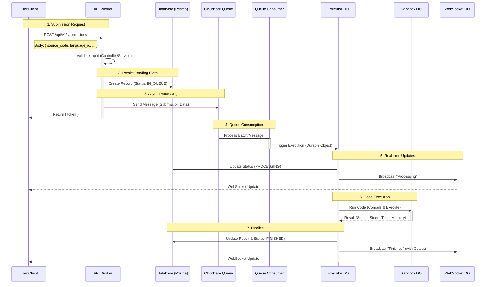

# Run-Flare v1 Submission Architecture & Flow

This document outlines the architecture and flow of a code submission in the `v1` system.

## Architecture Overview

The system follows a **Layered Architecture** running on **Cloudflare Workers**:

1.  **Controller Layer**: Handles HTTP requests, parsing, and response formatting.
2.  **Service Layer**: Contains business logic, validation, and orchestration.
3.  **Repository Layer**: Manages database interactions (Prisma).
4.  **Infrastructure Layer**: Handles asynchronous processing via Queues and Durable Objects.

## Submission Flow Diagram



## Detailed Flow Breakdown

### 1. User Input (The Body)
The user sends a `POST` request with the following JSON body:

```json
{
  "source_code": "console.log('Hello World')",
  "language_id": 1,
  "stdin": "optional input",
  "expected_output": "optional expected output",
  "cpu_time_limit": 2.0,
  "memory_limit": 128000,
  "test_cases": [
    { "stdin": "1 2", "expected_output": "3" }
  ]
}
```

### 2. API Handling (`src/controllers/SubmissionController.ts`)
- **Entry Point**: `create()` method.
- **Action**: Parses the body and calls `SubmissionService`.

### 3. Service Logic (`src/services/SubmissionService.ts`)
- **Validation**: Checks if `language_id` exists and input is valid.
- **Database**: Creates a new submission record with status `IN_QUEUE` (ID: 1).
- **Queueing**: Pushes the submission data to `env.SUBMISSION_QUEUE`.
- **Response**: Immediately returns a `token` to the user.

### 4. Queue Processing (`src/index.ts`)
- **Handler**: `queue()` function in the worker.
- **Action**: Receives the message from the queue.
- **Routing**: Instantiates the `SubmissionExecutor` Durable Object for this specific submission.

### 5. Execution (`src/durableObjects/SubmissionExecutor.ts`)
- **State Update**: Marks submission as `PROCESSING` in DB.
- **WebSocket**: Sends a "Processing" event to the `SubmissionWebSocket` Durable Object to notify the client.
- **Compilation**: Compiles the code if the language requires it (e.g., C++, Java).
- **Sandboxing**: Calls `env.SANDBOX` (another Durable Object) to run the code securely.
- **Result**: Captures `stdout`, `stderr`, `time`, `memory`, and `exit_code`.

### 6. Completion
- **Database**: Updates the submission record with the final results and status.
- **WebSocket**: Broadcasts the final result to the user.
- **Callback**: If a `callback_url` was provided, sends a POST request with the results.
